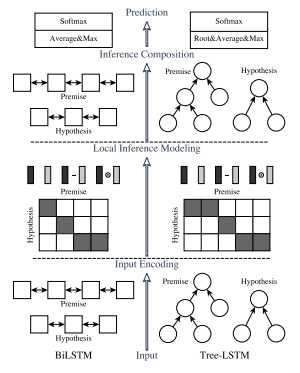

# Enhanced LSTM for Natural Language Inference

## Task: Natural Language Inference (Hypothesis and Premise)

## Dataset: SNLI

## Models:

- **Enhanced Sequential Inference Model (ESIM)**  
  A chain LSTM-based sequential model that captures local inference via soft alignment and enhanced feature interactions.

- **Hybrid Inference Model (HIM)**  
  An ensemble of ESIM with syntactic tree-LSTM components that incorporate constituency parsing information for further improvement.

## Model Architecture:

- **Input Encoding:**  
  Uses bidirectional LSTMs (BiLSTM) to encode both the premise and hypothesis, and also incorporates tree-LSTM modules when syntactic parsing is available.

- **Local Inference Modelling:**  
  Computes soft attention between encoded words and phrases, and enhances the local representations by concatenating the original vectors with their difference and element-wise product.

- **Inference Composition:**  
  Composes the enhanced local inference information via sequential (BiLSTM) or recursive (tree-LSTM) layers, followed by pooling (average and max) and a multilayer perceptron (MLP) classifier.

## Training:

_Training used the Adam optimisation method with a learning rate of 0.0004, a batch size of 32, and 300-dimensional hidden states for all LSTM modules and word embeddings. Pre-trained 300-D Glove vectors initialised the embeddings, with out-of-vocabulary words sampled from a Gaussian distribution._

## Results:

| Model (this paper)                                       | Parameters | Train (% acc) | Test (% acc) |
| -------------------------------------------------------- | ---------- | ------------- | ------------ |
| (16) Enhanced Sequential Inference Model (ESIM)          | 4.3M       | 92.6          | 88.0         |
| (17) Hybrid Inference Model (HIM; ESIM + syn. tree-LSTM) | 7.7M       | 93.5          | 88.6         |

_The best result (HIM) achieves an accuracy of 88.6% on the SNLI test set, setting a new state of the art on the dataset._
