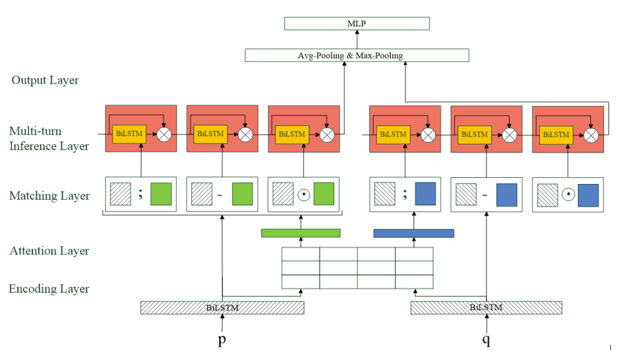

# Multi-turn Inference Matching Network for Natural Language Inference

## Task: natural language inference (hypothesis and premise)

## Dataset: SNLI

## Model:

- Multi-turn Inference Matching Network (MIMN)
- Multi-turn Inference Matching Network-memory: removes the memory component
- Multi-turn Inference Matching Network-gate+ReLU: replaces update gate in them memory component with a ReLU layer

## Model architecture:

## Training (split is very odd? >96% training for SNLI):

| Dataset | Sentence Pairs | Train   | Valid | Test  | Labels  |
| ------- | -------------- | ------- | ----- | ----- | ------- |
| SNLI    | 570k           | 549,367 | 9,842 | 9,824 | N, E, C |
| MPE     | 10k            | 8,000   | 1,000 | 1,000 | N, E, C |
| SCITAIL | 24k            | 23,596  | 1,304 | 2,126 | N, E    |

## Results:

| Model (this paper)        | Parameters | Train (%acc) | Test (%acc) |
| ------------------------- | ---------- | ------------ | ----------- |
| (13) 600D MIMN            | 5.3m       | 92.2         | 88.3        |
| (14) 600D MIMN-memory     | 5.8m       | 87.5         | 87.5        |
| (15) 600D MIMN-gate+ReLU  | 5.3m       | 90.7         | 88.2        |
| (16) 600D MIMN (Ensemble) | -          | 92.5         | 89.3        |
